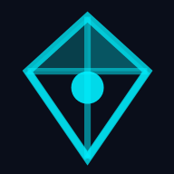

# Aethos Work



**Aethos Work** - The Anti-Intranet for Microsoft 365 Intelligence

---

# 👋 START HERE - Aethos v1 Documentation Guide

**Welcome!** You're about to build Aethos v1. Here's how to navigate the documentation.

---

## 📚 **Core Documentation (Read in Order)**

1. **`/docs/AETHOS_CONSOLIDATED_SPEC_V2.md`** ← 📕 MAIN SPEC (read first!)
2. **`/docs/AETHOS_CONTENT_ORACLE_V1_SPEC.md`** ← Content Oracle deep-dive (metadata intelligence)
3. **`/docs/ORACLE_SEARCH_PERSONAS.md`** ← Example search queries by user type (UX guidance)
4. **`/docs/SIMPLIFIED_ARCHITECTURE.md`** ← Tech stack (Vercel + Supabase)
5. **`/docs/V1_IMPLEMENTATION_ROADMAP.md`** ← 12-week build plan
6. **`/docs/PRICING_STRATEGY_CLARITY.md`** ← Monetization model (reference pricing)

---

## 🗂️ **File Structure Quick Reference**

```
aethos/
├── READ_ME_FIRST.md                    ← YOU ARE HERE
├── QUICK_START_GUIDE.md                ← 15-min setup guide
├── COMPLETE_SUMMARY.md                 ← High-level overview
├── HANDOFF_READINESS_ASSESSMENT.md     ← Readiness score (85/100 - Ready!)
│
├── docs/
│   ├── AETHOS_CONSOLIDATED_SPEC_V2.md      ← 📕 MAIN SPEC (read first!)
│   ├── AETHOS_CONTENT_ORACLE_V1_SPEC.md    ← 📗 Oracle details (read second!)
│   ├── ORACLE_SEARCH_PERSONAS.md         ← 📖 Example search queries
│   ├── SIMPLIFIED_ARCHITECTURE.md        ← 📜 Tech stack
│   ├── V1_IMPLEMENTATION_ROADMAP.md        ← 📘 12-week plan (read third!)
│   ├── PRICING_STRATEGY_CLARITY.md       ← 📝 Monetization model
│   │
│   └── ... (other docs)
│
├── guidelines/
│   └── Guidelines.md                   ← Design system (Aethos Glass)
│
├── src/
│   ├── app/
│   │   ├── components/
│   │   │   ├── MetadataIntelligenceDashboard.tsx  ← Example: Fully built!
│   │   │   ├── GlassCard.tsx                       ← Design pattern
│   │   │   └── ... (60+ components)
│   │   │
│   │   └── App.tsx                     ← Entry point
│   │
│   └── standards/
│       └── DECISION-LOG.md             ← Why decisions were made
│
└── migrations/                         ← (you'll create these Week 1-2)
```

---

## ✅ **Your First 3 Tasks (Today)**

### **Task 1: Read Core Docs (4 hours)**
- [ ] Read CONSOLIDATED_SPEC (Sections 1-7)
- [ ] Skim CONTENT_ORACLE_V1_SPEC (focus on database schemas)
- [ ] Read V1_IMPLEMENTATION_ROADMAP (Week 1-2 tasks)

### **Task 2: Set Up Accounts (30 min)**
- [ ] Create [Supabase account](https://supabase.com) (free tier)
- [ ] Create [Vercel account](https://vercel.com) (free tier)
- [ ] Register Azure AD app (Microsoft Entra ID)

### **Task 3: Local Setup (30 min)**
- [ ] Clone this repo
- [ ] Run `npm install`
- [ ] Create `.env` file with your keys
- [ ] Run `npm run dev` (should see Aethos UI at localhost:5173)

**After these 3 tasks, you're ready to start Week 1-2 (Database + Auth)!**

---

## 🎯 **What Am I Building?**

**Aethos** = "The Anti-Intranet" for Microsoft 365 tenants

**3 Core Modules (v1):**
1. **The Constellation** - Discovery & governance (scan M365/Slack, find waste)
2. **The Nexus** - Workspaces (curated collections like playlists)
3. **The Oracle** - AI search with metadata intelligence

**Timeline:** 12 weeks  
**Tech Stack:** React + Vercel + Supabase + Microsoft Graph API  
**Cost:** $0-5/month for MVP

---

## 📋 **Key Decisions Already Made**

✅ **Architecture:** Simplified (Vercel + Supabase) for v1, Azure later  
✅ **Content Oracle:** v1 (not v2) - Metadata enrichment + opt-in content reading  
✅ **AI Features:** All toggleable (some clients don't want AI)  
✅ **RBAC:** Plain English roles (Admin, Creator, Member)  
✅ **Connectors:** Tiered (M365/Slack full, Google read-only)  
✅ **Pricing:** $499/mo base + $199/mo AI+ (reference/suggested, flexible for market testing)

---

## 🆘 **When You Get Stuck**

### **Documentation:**
1. Check CONSOLIDATED_SPEC first
2. Check CONTENT_ORACLE_V1_SPEC for Oracle questions
3. Check V1_IMPLEMENTATION_ROADMAP for code examples
4. Check Guidelines.md for design questions

### **Community:**
- Supabase Discord: https://discord.supabase.com
- Vercel Discord: https://discord.gg/vercel
- Microsoft Graph Q&A: https://aka.ms/graph/qna

### **Product Owner (Me):**
- Weekly check-ins for product questions
- Async via Slack/email for clarifications
- Approval needed for scope changes

---

## 🎉 **You're Ready!**

Everything you need is documented. The prototype has 60+ components ready to use. Database schemas are defined. Architecture decisions are made.

**Next step:** Read CONSOLIDATED_SPEC (Sections 1-7) then come back here.

**Let's build Aethos! 🚀**

---

## 📞 **Quick Links**

- **Main Spec:** `/docs/AETHOS_CONSOLIDATED_SPEC_V2.md`
- **Oracle Spec:** `/docs/AETHOS_CONTENT_ORACLE_V1_SPEC.md`
- **Build Plan:** `/docs/V1_IMPLEMENTATION_ROADMAP.md`
- **Quick Start:** `/QUICK_START_GUIDE.md`
- **Supabase:** https://supabase.com
- **Vercel:** https://vercel.com
- **Microsoft Graph:** https://developer.microsoft.com/graph

**Questions? Check the docs first, then ask me!**
